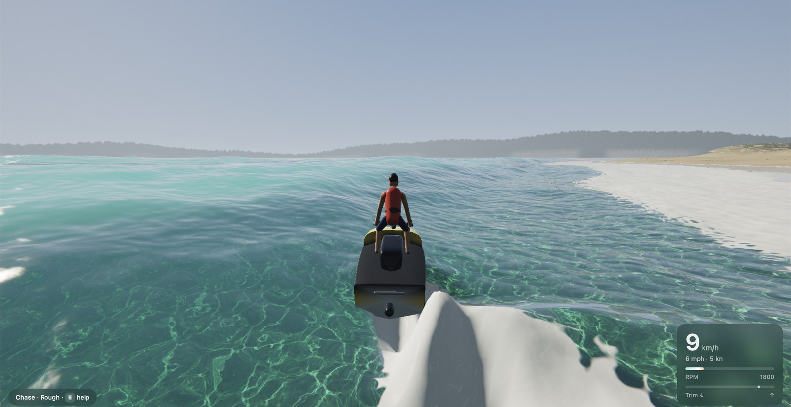

# Clearwater Jetski

DEMO: https://clearwaterjetski.vercel.app/

Clearwater Jetski is a jetski simulator with real water physics, in a single HTML file. Pick your jetski on the start screen: the **stand-up racer** (160 hp, ridden standing and leaned hard) or the **sit-down cruiser** (300 hp, seated, faster and more stable). It uses WebGL2, with no libraries, no build step and no install. It's built on [Clearwater](https://github.com/Aureliengmz/clearwater), Aurélien's real-time photoreal water renderer.



## Play

Play the [demo](https://clearwaterjetski.vercel.app/) in a desktop browser (Chrome, Edge or Firefox) on a computer with a graphics card, or download [`index.html`](index.html) and open it. Click or press any key to start riding.

Or clone the repository and open `index.html` from it:

```
git clone https://github.com/cghub7/clearwater_jetski
```

It needs WebGL2 with float render targets. Graphics has four presets (Low, Medium, High, Ultra): the first run picks one automatically from the frame rate and then sticks with it, and the Graphics button or `G` switches and remembers your choice.

| Control | |
| --- | --- |
| `W` / `S` or `↑` / `↓` | Throttle / brake and reverse |
| `A` / `D` or `←` / `→` | Steer (the jet only steers under throttle, like a real one) |
| `Q` / `E` | Trim the nose down / up; pitch in the air |
| `Shift` | Attack stance: lean in hard for tighter turns |
| `C` | Chase / first-person camera |
| `G` | Graphics preset: low, medium, high, ultra |
| `V` | Water type: tropical, Mediterranean, coastal, murky (also on the start screen) |
| `1`–`5` | Sea state: glassy, light chop, choppy, rough, surf (big breaking waves) |
| `R` · `M` · `H` | Reset · mute · help |
| Mouse drag / wheel | Look around / zoom |
| Gamepad | Stick steers, RT gas, LT brake, Y camera, B reset |
| Touch | Left pad steers, GAS pad throttles; **Sea**, **Camera** and **Gfx** buttons at the top right; tap the bottom-left pill for the menu (switch jetski); a **Flip upright** button appears when you capsize |

**Things to try**
- **Jump the surf.** Turn around and head for the beach. Wait just outside the white water for a set (a bigger wave arrives every seventh), then ride out straight into it at full throttle.
- **Jump your own wake.** Carve a tight circle at speed and cross back over the waves you made.
- **Park on the beach.** Ride up onto the sand. With the ski beached, `W` / `S` walk it forward or back into the water.

## How it works

- **Ocean.** Two FFT wave cascades run on the CPU: a JONSWAP wind sea plus swell, at 256 m and 27 m. The physics and the renderer use the same heights, so the waves you see are the waves you hit. Clearwater's GPU cascade adds fine detail. The surface is choppy: water is displaced sideways as well as up and down, giving sharp crests and flat troughs (the physics inverts the displacement, so it rides the same surface). Whitecaps appear where the surface is compressed (the Jacobian of the displacement) and leave foam that drifts and fades. Waves damp over shallows.
- **Surf.** A long-period swell shoals over the beach profile using linear finite-depth theory (tabulated and shared with the shader). Sets arrive every seventh wave; on the Surf setting set waves reach ~5 m crests (7 m faces). As a wave nears its break point (height ~0.8 × depth) its front compresses into a steep, glassy face of up to ~75° and the chop on it calms. Big waves plunge: from the moment the face goes vertical, the lip throws forward 0.35–0.6 × the wave height and lands in the trough ~0.22 wave periods later, forming a barrel. It's drawn as a clear-water sheet (a heightfield can't overhang) you see the face through, glowing turquoise when backlit. The breaking stage is one shared function, so the lip, the feathering on the crest, the white landing band, the splash-up and the rolling bore stay in step, and breaking peels along the crest from the peaks. Bores dump again on the sand as a shorebreak. Swell hitting the island rocks bursts into spray.
- **Jetski physics.** Two craft share the hydrodynamics: a stand-up race ski (2.55 m hull with the rider standing in a recessed tray, 160 hp, 330 kg with the rider) and a sit-down cruiser (3.3 m, 300 hp, 430 kg), each a rigid body with its own hull, pump and rider handling. Every triangle of the hull gets hydrostatic pressure, hydrodynamic pressure and suction, plus skin friction. Planing, porpoising, slamming and airtime all come out of that model. The jet pump vectors its thrust to steer and loses grip when the intake leaves the water. Keel and sponson foils give the hull its bite, and the rider balances, leans into turns and soaks up pitching with their knees. The tray is part of the hull shape, so water in it pushes the ski down.
- **Wake.** A dispersive wave solver in Fourier space (eWave-style, exact deep-water dispersion `ω = √(gk)`) runs in a 72 m window that follows the ski. It's driven by the hull's measured lift spread over its wetted footprint, swept along the path the hull took each frame (no gaps at speed) and boosted once the hull planes, so crests reach realistic heights (~0.3-0.4 m). You get a Kelvin V wake while moving and rings when you land. The heights are read back to the CPU every frame, so the ski can ride its own wake.
- **World.** A sandy beach with swash, wet sand, a strand line and dunes, backed by wooded hills. The bay floor deepens offshore, and there are rocky islands with pebble coves. The terrain uses the same formula in JS and GLSL, so collisions match what you see.
- **Rendering.** Clearwater's water shading (Fresnel, absorption, refracted caustics, sun glints, lens glare) extended with a combined water/terrain ray march. Water colour comes from ocean optics: pure-water absorption plus chlorophyll, dissolved organics and sediment, in four presets. The sky is a physically based atmosphere (Rayleigh and Mie single scattering, baked once) with clouds. The water reflects the islands and hills (High and Ultra), and FXAA smooths edges (Medium and up). Foam and spray use textures generated procedurally at start-up. Also a modelled jetski and animated rider, and a synthesized engine sound.

| URL option | Effect |
| --- | --- |
| `?debug` | Frame rate, resolution, jetski state |
| `?fp` | Start in first person |
| `?wake=512` | Force the finer wake grid (Ultra uses it; the default is 256²) |
| `?view=wake` / `?view=surf` | Debug maps of the wake and surf height fields |
| `?craft=sit` / `?craft=stand` | Start on a specific jetski |
| `?water=0`–`3` | Water type |
| `?noaa` | Turn off anti-aliasing |
| `?auto` | Autopilot |
| `?bench` | Log the GPU time of each render stage to the console |

## Clearwater

Clearwater is Aurélien's real-time, photoreal shallow-water renderer: FFT waves, refracted light caustics with dispersion, physically based Fresnel and sun glints, lens-diffraction glare and interactive ripples. The original lives in the [upstream repository](https://github.com/Aureliengmz/clearwater), with its own [live demo](https://aureliengmz.github.io/clearwater/).


The seabed texture is base64 in `<script id="pebbles-texture">` at the end of `index.html`. To regenerate it, run `python tools/make_pebbles.py` (needs numpy, scipy and pillow).

## References

- Jerry Tessendorf, *Simulating Ocean Water*: FFT waves
- Jerry Tessendorf, *eWave: Using an Exponential Solver on the iWave Problem*: the wake solver
- Jacob Kerner, *Water interaction model for boats in video games*: per-panel hull forces
- Evan Wallace, *WebGL Water*: refracted-grid caustics
- Inigo Quilez, *Texture repetition*: seabed tiling
- Marc Olano & Dan Baker, *LEAN Mapping*: distant highlights

## Credits

The water renderer is Clearwater, made by [Aurélien](https://x.com/Aurelien_Gz) at [Lumaris](https://lumaris.works). Clearwater Jetski is built on top of it.

MIT License, see [LICENSE](LICENSE).
